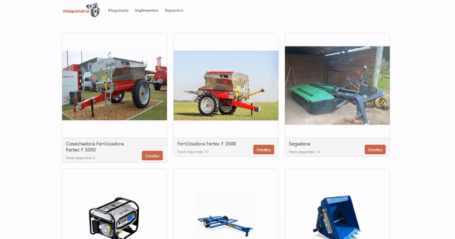

# maquinaria_uy-Carballido

## Proyecto

Este proyecto es el trabajo entregable del curso React Js de Coder House.
Para esta consigna se decidió construir una página web para la venta de maquinaria agrícola.

El proyecto está construido con React y hace uso de Bootstrap como framework CSS.
Se buscó construir una interfaz simple que permitiese aplicar las tareas del curso y mostrar la información de forma clara al usuario.

Se separaron 3 categorías principales: Maquinaria, Implementos y Repuestos para agregar variedad a los productos mostrados y poder probar diferentes combinaciones de atributos.

Este trabajo podría ser extendido y aplicado a una tienda real, agregando algunas funciones extra como Login, y medio de pagos electrónicos.

### GIF con procedimiento de compra

